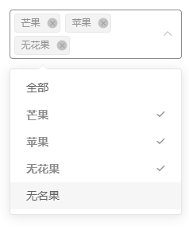

# 	使用elementUI的Select组件增加全选功能

## 摘要

 	在elementUI的库中，select组件是没有全选这个操作的。但是在日常开发中我们难免会需要使用全选的时候。因此如果我们使用了select组件来完成全选操作，主要包括全选的几种逻辑

+ 如果勾选了“全部”，那么我们将所有选项选中
+ 如果取消“全部”，那么我们删除所有已选
+ 如果取消一个非“全部字段的”的项，那么我们需要将已选中的“全部取消
+ 如果选择了出“全部”之外的所有项，那么我们需要把包括“全部”的都勾选

效果如下：



## 关键词：element，select，全选

## 代码实现

```vue
<el-select v-model="val" multiple @change="selectChangeHandle">
			<el-option :value='code' :label='name' v-for="					{code,name} in options" :key='code'>
			</el-option>
</el-select>
```

```js
	data() {
		return {
			val: [],
      flag:false,//之前是否勾选了全部
			options: [{
				code: -1,
				name: '全部'
			}, {
				code: 0,
				name: '芒果',
			}, {
				code: 1,
				name: '苹果',
			}, {
				code: 2,
				name: '无花果',
			}, {
				code: 3,
				name: '无名果',
			},
			]
		}
	}
	,

	methods: {
		selectChangeHandle(newArr) {
			const curFlag = newArr.some(item => item == -1)//当前是否勾选了全部；
			if (this.flag && !curFlag) {
				// 如果之前勾选了全部，但是这一次没勾选，说明是取消全部这个操作，这时清空所有的选择
				this.flag = false;
				this.val = [];
			} else if (!this.flag && curFlag) {
				// 如果之前没勾选但是当前勾选了，说明这一次是勾选所有的情况，因此我们把所有的给选上
				this.flag = true;
				this.val = this.options.map(item => item.code)
			} else {
				// 本次勾选了除全部之外的选项的情况
				if (curFlag && newArr.length < this.options.length) {
					// 本次有中存在全部，但是总数不够，则把全部取消掉
					this.flag = false;
					this.val = newArr.filter(item => item != -1);
				} else if (!curFlag && newArr.length == this.options.length - 1) {
					this.flag = true;
					this.val = this.options.map(item => item.code)
				}
			}
		}
	}
}
```

