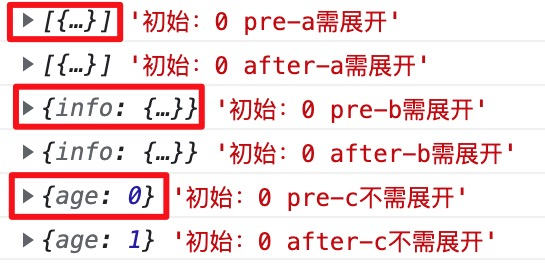

# 你没注意的浏览器console.log「异步打印现象」

## 结论
> 针对在浏览器控制台出现打印结果和代码执行顺序不一致这种「异步现象」。网上主要有两种说法，笔者这里更喜欢第一种，好理解且符合笔者的测试
> + 浏览器出于优化的目地，默认不会展开所有对象，只有当手动点击展开时才去”读取对应的值“来进行展示。「点击」是一个代码执行完成之后的行为，所以对深层对象的打印总是最后时刻的快照。
> + 不同的浏览器可能有自己的console.log实现机制，受限于I/O性能可能打印的时机会与代码执行的时机不匹配。也就是说如果打印的时机如果较为靠后，那么打印时因为引用型的数据发生了修改，所以出现改变前后打印结果都一致的现象

## 正文
`console.log`是日常开发中用的较多的调试技巧。我们都知道他能把信息打印到控制台中。考虑下面的例子
```js
			const a=[{name:0}];
			console.log(a);
			a[0].name++;
			console.log(a);
```
在我们的认为中应该先后打印
```js
			// [{name:0}]
			// [{name:1}] 
```
但是经笔者实际实验下来 「谷歌浏览器版本 93.0.4577.82（正式版本） (x86_64)」 。实际打印的和感觉上的差别很大,实际打印了
```js
			// [{name:1}]
			// [{name:1}] 
```
从这个结果看，好似console.log是一个异步的方法，打印是在代码执行完之后才进行的操作。
从「你不知道的JavaScript中卷」翻阅到
>并没有什么规范或一组需求指定console.* 方法族如何工作——它们并不是JavaScript 正式
的一部分，而是由宿主环境（请参考本书的“类型和语法”部分）添加到JavaScript 中的。因此，不同的浏览器和JavaScript 环境可以按照自己的意愿来实现，有时候这会引起混淆。
尤其要提出的是，在某些条件下，某些浏览器的console.log(..) 并不会把传入的内容立即输出。出现这种情况的主要原因是，在许多程序（不只是JavaScript）中，I/O 是非常低速的阻塞部分。所以，（从页面/UI 的角度来说）浏览器在后台异步处理控制台I/O 能够提高性能，这时用户甚至可能根本意识不到其发生。

好吧，上面一大段看的头疼。但大概意思就是说不同的浏览器可能有自己的console.log实现机制，受限于I/O性能可能打印的时机会与代码执行的时机不匹配。也就是说如果打印的时机如果较为靠后，那么打印时因为引用型的数据发生了修改，所以出现改变前后打印结果都一致的现象。这么一说貌似也能说的通。我们在看看下一个例子：
```js
		const c={age:0}
		console.log(c);
		c.age++
		console.log(c);
		//先后的打印结果为
		//{age: 0}
		//{age: 1}
```
看到这属实蚌埠住了，为啥这个例子又能符合我们的逻辑认知呢？运行示例代码看下图
```js

		const a=[{name:0}]
		console.log(a,'初始：0 pre-a需展开');
		a[0].name++
		console.log(a,'初始：0 after-a需展开');
		const b={info:{age:0}}
		console.log(b,'初始：0 pre-b需展开');
		b.info.age++
		console.log(b,'初始：0 after-b需展开');
		const c={age:0}
		console.log(c,'初始：0 pre-c不需展开');
		c.age++
		console.log(c,'初始：0 after-c不需展开');
```



有什么共通之处？从图中可以看出浏览器控制对于对象和数组只能默认展开第一层，更深的对象是用“..."表示的。**因此这里就有另一种说法，浏览器出于优化的目地，默认不会展开所有对象，只有当手动点击展开时才去”读取对应的值“来进行展示。**这么一来上面的所有的示例在这个角度也能说的通。

## 参考资料
+ 你不知道的JavaScript中卷
+ [https://juejin.cn/post/6956103205650432037](https://juejin.cn/post/6956103205650432037)
